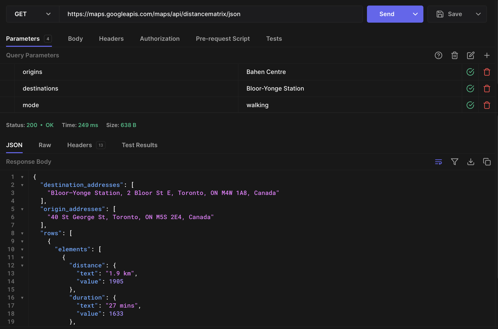
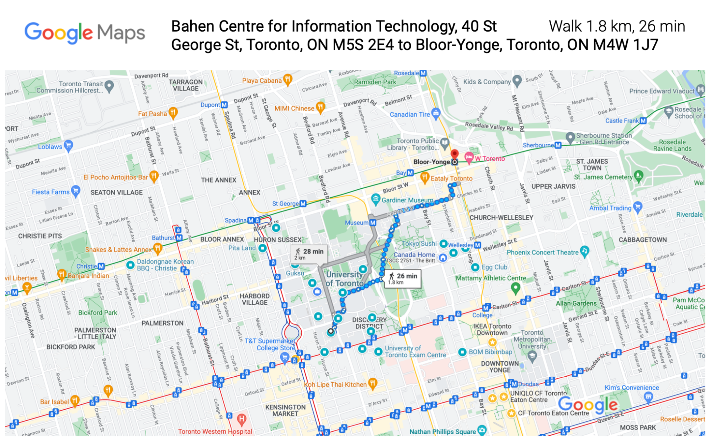
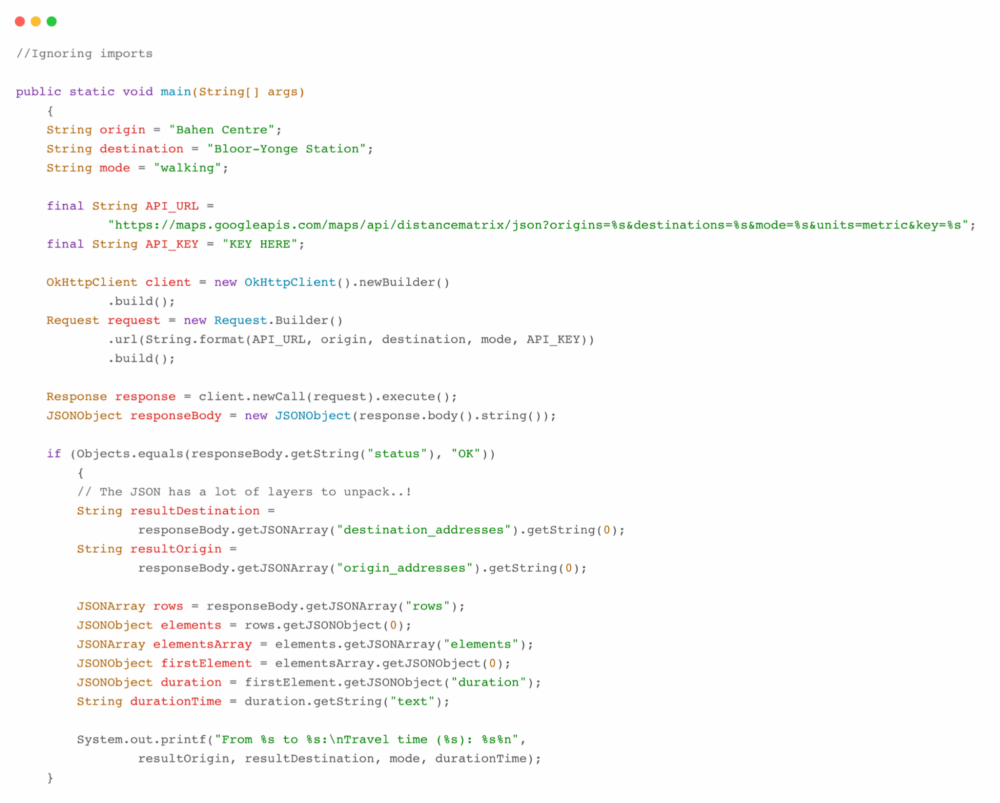
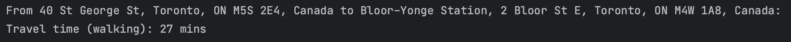
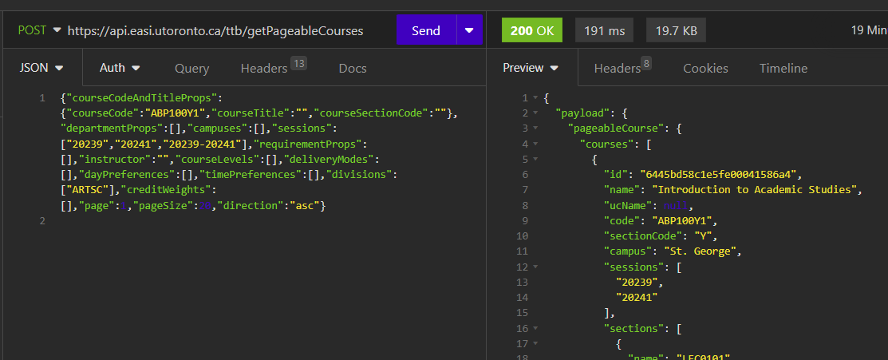
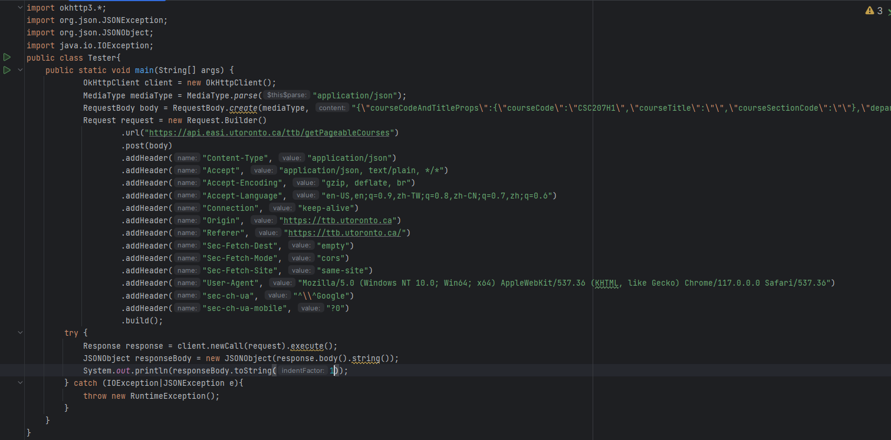
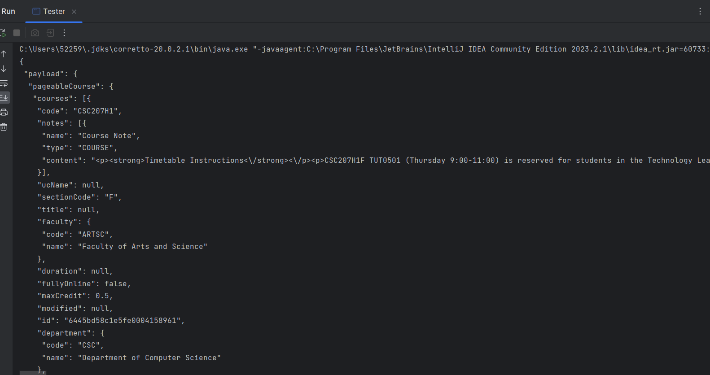

# UofTCourseScheduleOptimizer
Optimizing student's schedule by suggesting a course schedule and path that is the most efficient.

## Description of Problem Domain
Every student knows the struggle of piecing together a class schedule that doesn't have them sprinting from one end of campus to the other in 10 minutes. The juggle of ensuring classes aren't overlapping, and the hunt for the optimal path between buildings is real. The key challenge here is to integrate course selection with efficient campus navigation for a seamless scheduling experience.

## High-level Description
Our application aims to redefine academic scheduling by incorporating intelligent campus navigation. Here's how we envision it:
Input Courses: Students will input their tentative courses for the semester.
Timetable Generation: The app will then whip up the most efficient timetable, ensuring no overlaps and optimizing for the shortest travel distances between classes.
Campus Map Integration: To make it even more intuitive, our app will also include a visual map, highlighting the route for each day based on the student's schedule. Think of it as a Google Maps tailored for academic scheduling.

## Google Maps API Documentation
We will be using the Google Maps Distance Matrix API for determining the distance as well as travel time between two point on campus. The distance retrieved from the API call is not a simple straight line on Google Maps but an actual, physical route determined by a user-chosen mode of transport (walking, biking, transit). The Distance Matrix API also allows the querying of multiple origin/destination pairs in a single API call, which makes it ideal for our purpose.

Official overview/documentation: https://developers.google.com/maps/documentation/distance-matrix/

## Google Maps API Test Screenshot
Hoppscotch test using Bahen Centre as origin and Bloor-Yonge Subway Station as destination:

	

Screenshot from Google Maps directly:

	

## Google Maps API Java Code Example + Result

	

Result:

	

## UofT Course API Documentation
There are no public UofT course APIs so no documentation. However we could still access course information using API-like java codes requesting to https://ttb.utoronto.ca/.

## UofT Course API Test Screenshot
Using Insomnia REST, we have:

	

Indeed, the java code responsible for these outputs are:

	
    

## Technical Problems
- Algorithm for optimization
