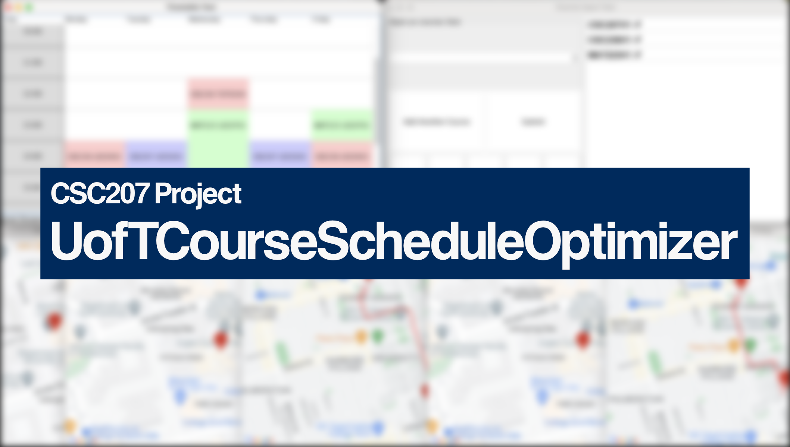
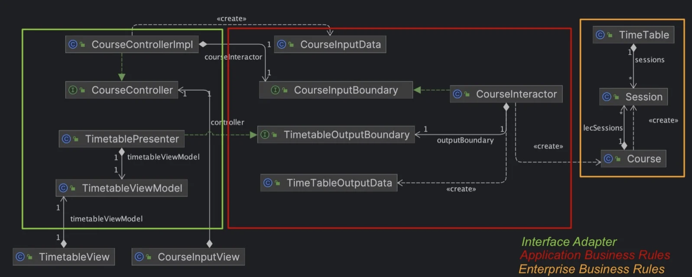
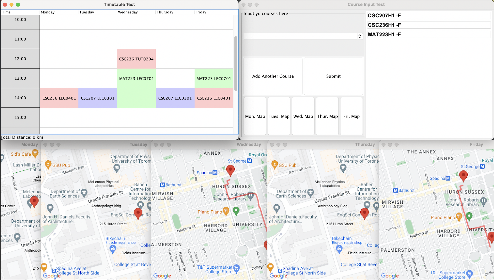

# Distance-Based Timetable Organiser
*Generate University of Toronto timetables with minimal distances between buildings*

For the project *Blueprint*, see [BLUEPRINT.md](BLUEPRINT.md)

	

## Core Features
Our application aims to redefine academic scheduling by incorporating intelligent campus navigation. Here's how we envision it:
- Input Courses: Students input their tentative courses for the semester.
- Timetable Generation: The app will then whip up the most efficient timetable, ensuring no overlaps and optimizing for the shortest travel distances between classes.
- Campus Map Integration: To make it even more intuitive, our app also includes visual maps, highlighting the route for each day based on the student's schedule.

## Additional Features
- Input any number of courses, from 1 to 5.
- Autocomplete course codes.
- Detect invalid course codes and show an error message.
- Fully dynamic windows with resizing.

## Dev Features for Geeks
- Project is structured using the Clean Architecture engine:

	

- The UofT Course API, Map Render API, and Algorithm are all designed with expandability in mind. To use a new variation of the above, simply implement their corresponding interface(s).
- Javadoc is provided for most, if not all public classes and methods.

## Installation
There are no compiled binaries available at the moment.
To compile from source:
- Have Java Development Kit 20 or higher
- Install and run the UofT Course API, details under [API Utilisation](#api-utilisation)
- Set up a Google Cloud project and enable 3 APIs:
  - Distance Matrix API
  - Directions API
  - Maps Static API
- Use any modern IDE, or compile directly

## Usage

	

Upper-right window:
- Use the search bar to search for courses.
- Once a desired course is selected, click "Add Another Course". The added course will appear on the list on the right.
- Add up to 5 courses.
- Once all courses are added, click "Submit". The program will load and compute a schedule for a couple of seconds.

Upper-left window:
- This is the timetable window, where added and optimised courses appear.
- This window is resizable and scrollable.
- Courses will be updated automatically whenever a new "submit" request is made.

Lower window(s):
- By clicking on any of the five "Map" buttons on the upper-right window, a visual map of a single day's schedule can be viewed.
- Waypoint markers and route lines will be automatically placed.

## API Utilisation
- Custom UofT course information API with data sourced from the UofT [Timetable Builder](https://ttb.utoronto.ca). Repository and setup instructions: [LINK HERE]
- [Google Distance Matrix API](https://console.cloud.google.com/marketplace/product/google/distance-matrix-backend.googleapis.com) for distance calculation.
- [Google Directions API](https://console.cloud.google.com/marketplace/product/google/directions-backend.googleapis.com) for route polyline retrieval.
- [Google Maps Static API](https://console.cloud.google.com/marketplace/product/google/static-maps-backend.googleapis.com) for map PNG rendering.

## Contributors
In alphabetical order:
- Aurora Lu ([GitHub](https://github.com/pingluuu))
- Bayan Mehr ([GitHub](https://github.com/bayanmehr))
- Jacky Tan ([GitHub](https://github.com/52259tan))
- Joshua Jang ([GitHub](https://github.com/musicofmusix))
- Percy Phan ([GitHub](https://github.com/percy-ai))

"We love cats" - Percy Phan

## Licensing
This project is licensed under the MIT license. Please feel free to use, modify, or simply take the concept and create derivative work.